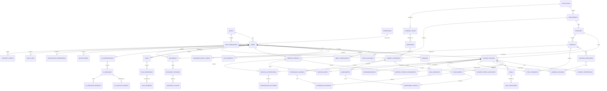

# Entity Relationship Diagram

This document defines the core relational database schema for the AI-Based Student Mentoring & Growth Platform.

## ERD (Mermaid)

```mermaid
erDiagram
    %% Identity
    ROLES ||--o{ USERS : has
    ROLES ||--o{ ROLE_PERMISSIONS : includes
    PERMISSIONS ||--o{ ROLE_PERMISSIONS : assigned_to
    USERS ||--o{ SESSIONS : manages
    USERS ||--o{ OAUTH_ACCOUNTS : links
    USERS ||--o{ EMAIL_VERIFICATIONS : requests
    USERS ||--o{ OTP_REQUESTS : requests
    USERS ||--o{ PASSWORD_RESET_TOKENS : requests

    %% Institution
    INSTITUTIONS ||--o{ DEPARTMENTS : contains
    INSTITUTIONS ||--o{ ACADEMIC_YEARS : schedules
    ACADEMIC_YEARS ||--o{ SEMESTERS : divided_into
    DEPARTMENTS ||--o{ PROGRAMS : offers

    %% Students & Mentors
    USERS ||--o| STUDENT_PROFILES : is
    USERS ||--o| MENTOR_PROFILES : is
    PROGRAMS ||--o{ STUDENT_PROFILES : enrolls
    DEPARTMENTS ||--o{ MENTOR_PROFILES : employs
    STUDENT_PROFILES ||--o| STUDENT_PREFERENCES : sets
    MENTOR_PROFILES ||--o{ MENTOR_STUDENT_ASSIGNMENTS : mentors
    STUDENT_PROFILES ||--o{ MENTOR_STUDENT_ASSIGNMENTS : mentored_by

    %% Academic
    PROGRAMS ||--o{ SUBJECTS : requires
    SUBJECTS ||--o{ SUBJECT_OFFERINGS : schedules
    SEMESTERS ||--o{ SUBJECT_OFFERINGS : happens_in
    USERS ||--o{ SUBJECT_OFFERINGS : teaches
    STUDENT_PROFILES ||--o{ ENROLLMENTS : registers
    SUBJECT_OFFERINGS ||--o{ ENROLLMENTS : accepts
    SUBJECT_OFFERINGS ||--o{ ASSESSMENTS : evaluates
    ASSESSMENTS ||--o{ ASSESSMENT_RESULTS : scores
    ENROLLMENTS ||--o{ ASSESSMENT_RESULTS : achieves

    %% Attendance
    SUBJECT_OFFERINGS ||--o{ ATTENDANCE_SESSIONS : conducts
    ATTENDANCE_SESSIONS ||--o{ ATTENDANCE_RECORDS : logs
    ENROLLMENTS ||--o{ ATTENDANCE_RECORDS : attends

    %% Tasks & Goals
    USERS ||--o{ TASKS : created_by
    USERS ||--o{ TASKS : assigned_to
    TASKS ||--o{ TASK_SUBMISSIONS : receives
    TASK_SUBMISSIONS ||--o{ TASK_FEEDBACK : reviewed_by
    STUDENT_PROFILES ||--o{ GOALS : sets
    GOALS ||--o{ GOAL_MILESTONES : tracked_by

    %% Learning
    SUBJECTS ||--o{ LEARNING_RESOURCES : has
    STUDENT_PROFILES ||--o{ LEARNING_SESSIONS : participates
    LEARNING_RESOURCES ||--o{ LEARNING_SESSIONS : uses
    STUDENT_PROFILES ||--o{ TOPIC_PROGRESS : measures
    SUBJECTS ||--o{ TOPIC_PROGRESS : contains

    %% AI & Analytics
    USERS ||--o{ AI_CONVERSATIONS : initiates
    AI_CONVERSATIONS ||--o{ AI_MESSAGES : contains
    AI_MESSAGES ||--o| AI_CONTEXT_RECORDS : grounded_by
    AI_MESSAGES ||--o| AI_RESPONSE_FEEDBACK : rated
    USERS ||--o{ DOCUMENTS : uploads
    SUBJECTS ||--o{ DOCUMENTS : categorizes
    DOCUMENTS ||--o{ DOCUMENT_VERSIONS : tracks
    DOCUMENT_VERSIONS ||--o{ DOCUMENT_CHUNKS : split_into

    %% Snapshots & Interventions
    STUDENT_PROFILES ||--o{ STUDENT_METRIC_SNAPSHOTS : recorded_in
    STUDENT_PROFILES ||--o{ RISK_SNAPSHOTS : evaluated_in
    STUDENT_PROFILES ||--o{ RECOMMENDATIONS : receives
    MENTOR_PROFILES ||--o{ MENTOR_NOTES : writes
    STUDENT_PROFILES ||--o{ MENTOR_NOTES : about
    MENTOR_PROFILES ||--o{ MENTOR_INTERVENTIONS : initiates
    STUDENT_PROFILES ||--o{ MENTOR_INTERVENTIONS : targeted_at
    MENTOR_INTERVENTIONS ||--o| INTERVENTION_OUTCOMES : results_in

    %% Security & Notifications
    USERS ||--o{ NOTIFICATIONS : receives
    USERS ||--o| NOTIFICATION_PREFERENCES : configures
    USERS ||--o{ AUDIT_LOGS : performs
    USERS ||--o{ SECURITY_EVENTS : triggers
```
